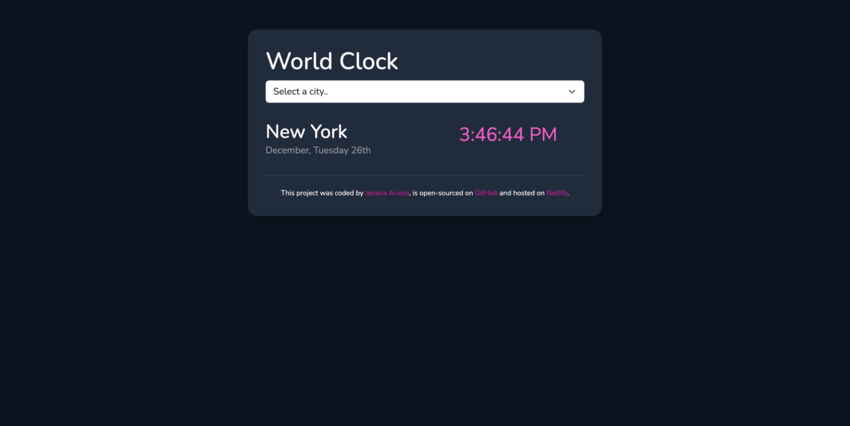

# World Clock App

This is a solution to the [SheCodes Plus AddOn Final Project](https://www.shecodes.io/workshops). SheCodes has multiple Online Coding Workshops made exclusively for women. Has a unique methodology and flexible schedules.

## Table of contents

- [Overview](#overview)
  - [The challenge](#the-challenge)
  - [How to use](#how-to-use)
  - [Screenshot](#screenshot)
  - [Links](#links)
- [My process](#my-process)
  - [Built with](#built-with)
- [Author](#author)

## Overview

### The challenge

- Introduction
  - The World Clock App is a web application that allows users to conveniently view and compare the current date and time across different locations and time zones. The project is hosted on Netlify, and the public GitHub repository is accessible for collaboration and further development.

- Features
  - Display 3 Different Dates and Times:
    - The application showcases the current date and time of three distinct locations, each situated in different time zones. This functionality provides users with a quick and efficient way to compare time across regions.

  - Select Element with Multiple Locations:
    - A user-friendly select element is implemented, offering a choice of at least three different locations. Users can easily switch between these locations to view the corresponding date and time.

  - Bonus Feature 1: Link to Homepage for Each Location:
    - As a bonus feature, the application includes a link to the homepage when displaying the details of a specific location. This allows users to quickly access additional information about the city or region.
  - Bonus Feature 2: User's Current Location:
    - Another bonus feature enhances user experience by providing the ability to see the date and time of the user's current location. This feature is optional but adds a personalized touch to the application.

### How to use
- Access the Application:
  - Visit the Netlify-hosted Time Zone Converter to use the application.
- Choose Locations:
  - Utilize the select element to choose from the available locations.
- Explore Bonus Features:
  - Click on the bonus links to navigate to the homepage of a specific location or enable the user's current location feature.

### Screenshot

### Links

- Live Site URL: [World Clock App](https://dynamic-baklava-e58770.netlify.app)

## My process

### Built with

- Semantic HTML5 markup
- CSS custom properties
- Flexbox
- CSS Grid
- Vanilla JavaScript
- [Sass](https://sass-lang.com/)
- [BootStrap](https://getbootstrap.com/) 
- [Moments.js](https://momentjs.com/)
- [Moments.js Timezone](https://momentjs.com/timezone/)

## Author

- Website - [Jessica Arvizu](https://www.linkedin.com/in/jessica-arvizu/)
